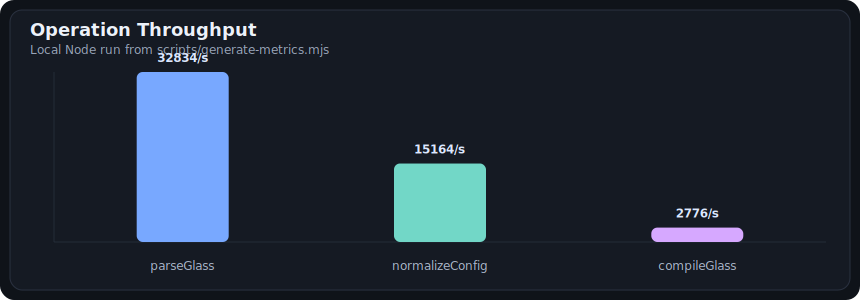
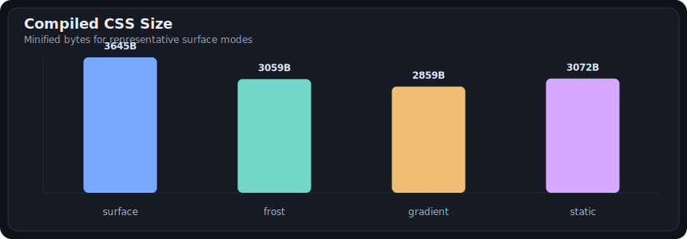
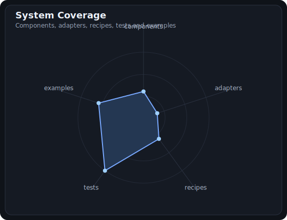

# GlassGradients

GlassGradients is a production-ready glass surface system for real product UI.

It gives you frosted glass, gradient surfaces, static CSS compilation, runtime motion, theme tokens, SSR helpers, framework adapters, and official component primitives without locking the core to one framework.

> Use the latest release: `npm i glassgradients@latest`
>
> Older `0.x` builds may show more historical downloads because they were published earlier. The maintained line is `1.x`, and the current release is `1.2.0`.

It supports five practical layers of use without breaking the public API:

- `surface`: composed glass + gradient layer
- `gradient`: gradients only
- `frost`: frosted glass only
- `theme/tokens`: reusable variables and SSR-safe theme bootstrap
- `components`: official product primitives such as panels, dialogs, tables, command palettes, terminals, and buttons
- `adaptive motion`: MER, Engine UP, and Motion Blurrin for opt-in high-control animation

## GitHub Lab

NPM keeps the install and usage story focused. GitHub is the technical lab: generated charts, metrics, CI, Pages demo, runtime checks, and integration coverage live here.

- Live lab: <https://brennoleon.github.io/glassgradients/>
- Metrics report: [docs/metrics/report.md](./docs/metrics/report.md)
- Raw metrics JSON: [docs/metrics/report.json](./docs/metrics/report.json)
- Lab docs: [docs/github-lab.md](./docs/github-lab.md)
- Site source: [site/index.html](./site/index.html)
- Verification: `npm run release:check`

| Area | Current |
| --- | ---: |
| Version | `1.2.0` |
| Public export entries | `22` |
| Framework/tool adapters | `12` |
| Official components | `32` |
| Recipes/contracts | `20` |
| Test cases | `81` |
| Examples | `40` |







## Why it exists

Most glassmorphism packages stop at demos.
GlassGradients is designed for product UI that has to survive real constraints:

- one config model for compile-time CSS and runtime motion
- separated `surface`, `gradient`, and `frost` modes
- recipes for real UI roles like `navbar`, `sidebar`, `modal`, `toolbar`, `badge`, `panel`, `hero`, `workspace`, `form`, `command-palette`, `dialog`
- premium recipes for technical surfaces like `table`, `inspector`, `terminal`, and `command-bar`
- official component primitives for React, Preact, and framework-agnostic design systems
- responsive variants and `prefers-color-scheme` variants in the same file
- semantic tokens and theme CSS export
- semantic recipe contracts for adapters and design systems
- SSR helper to avoid theme flash before hydration
- contrast-safe tuning for readable surfaces
- explicit performance profiles, including `static`
- LTS-safe public API: existing exports and legacy keys keep working

## New in 1.2.0

- MER adapts `performance: auto` using runtime hints without touching manual performance choices.
- `mainFilter` / `main-filter` separates standard glass, no backdrop filter, and opt-in heavy `blur-filters`.
- Engine UP controls motion, frames, blur, brightness, saturation, contrast, opacity, scale, rotation, and timing from `.glass`.
- Motion Blurrin creates moving circular blur fields with open gaps inside the surface.
- New effects: `caustic`, `liquid`, `nebula`, `iridescent`, `conic`, and `noise`.
- Tailwind v4 CSS-first helpers and shadcn-style copyable specs are available as additive adapters.
- Advanced shells were added for data grids, charts, timelines, kanban, calendars, comboboxes, dropdowns, toasts, tabs, resizable panels, spotlight overlays, and notification centers.
- CLI now includes `lint`, `format`, `tokens`, and `inspect --score`.

## Install

```bash
npm i glassgradients@latest
```

Framework adapters stay optional. Install them only in apps that already use that framework:

```bash
npm i glassgradients@latest react
npm i glassgradients@latest vue
npm i glassgradients@latest solid-js
npm i glassgradients@latest preact
```

If your lockfile still resolves `0.1.0` or another old build, update it explicitly:

```bash
npm i glassgradients@latest
npm update glassgradients
```

## Quick start

```bash
glassgradients init ./hero.glass --preset editor --recipe panel --mode surface
glassgradients build ./hero.glass -o ./hero.css --minify
```

```glass
selector: .hero
preset: editor
recipe: panel
mode: surface
```

## Same API, more power

The runtime API did not change.

```js
import { createGlassGradient } from "glassgradients";

const fx = createGlassGradient(".hero", {
  preset: "editor",
  recipe: "panel",
  mode: "surface",
  performance: "auto",
  contrastMode: "safe",
  animate: { mode: "orbit", fps: 42, speedMultiplier: 1.15 }
});
```

## Official Components

Use components when you want product primitives instead of hand-wiring recipes every time.

Framework-agnostic:

```js
import {
  createGlassComponentProps,
  createGlassComponentCss,
  listGlassComponents
} from "glassgradients/components";

const props = createGlassComponentProps("command-palette", {
  className: "app-command",
  input: { strength: "strong" },
  attrs: { "aria-label": "Command palette" }
});

const css = createGlassComponentCss("terminal", ".terminal-window", {}, { minify: true });
```

React:

```jsx
import {
  GlassButton,
  GlassCommandPalette,
  GlassDataGrid,
  GlassPanel,
  GlassTerminal
} from "glassgradients/components/react";

export function CommandCenter() {
  return (
    <GlassCommandPalette aria-label="Command palette">
      <GlassPanel input={{ recipe: "inspector" }}>Inspector</GlassPanel>
      <GlassDataGrid aria-label="Builds">Builds</GlassDataGrid>
      <GlassTerminal>npm run build</GlassTerminal>
      <GlassButton>Run</GlassButton>
    </GlassCommandPalette>
  );
}
```

Available official primitives:

- `GlassPanel`
- `GlassCard`
- `GlassButton`
- `GlassNavbar`
- `GlassSidebar`
- `GlassModal`
- `GlassDialog`
- `GlassToolbar`
- `GlassCommandBar`
- `GlassCommandPalette`
- `GlassTable`
- `GlassDataGrid`
- `GlassChart`
- `GlassTimeline`
- `GlassKanban`
- `GlassCalendar`
- `GlassCombobox`
- `GlassDropdown`
- `GlassToast`
- `GlassTabs`
- `GlassResizablePanel`
- `GlassSpotlightOverlay`
- `GlassNotificationCenter`
- `GlassInspector`
- `GlassTerminal`
- `GlassInput`
- `GlassBadge`
- `GlassDock`
- `GlassHero`
- `GlassWorkspace`
- `GlassForm`
- `GlassPopover`

Use the same method for separated modes:

```js
createGlassGradient(".hero-gradient", {
  mode: "gradient",
  effect: "ribbon",
  palette: "studio"
});

createGlassGradient(".hero-glass", {
  mode: "frost",
  recipe: "navbar",
  contrastMode: "safe"
});
```

## Modes

### `surface`

Use when you want the full composed effect.

```glass
mode: surface
preset: cinematic
recipe: hero
```

### `gradient`

Use when you only want animated or static gradients.

```glass
mode: gradient
effect: halo
glass.enabled: false
```

### `frost`

Use when you only want frosted glass surfaces.

```glass
mode: frost
gradient.enabled: false
contrastMode: safe
```

## MER, Engine UP, And Motion Blurrin

MER only changes output when `performance: auto` is active. Manual profiles remain manual.

```glass
selector: .premium-card
effect: liquid
performance: auto
mainFilter: standard
```

Use `mainFilter: none` when you want fill, border, shadow, and tokens without backdrop-filter cost:

```glass
mode: frost
mainFilter: none
```

Use the heavy filter only when the user explicitly wants it:

```glass
main-filter: blur-filters
```

Engine UP gives direct animation control:

```glass
engineUp:
  enabled: true
  duration: 14s
  x: 4%
  y: 2%
  scale: 1.08
  blur: 24
  brightness: 112%
```

Motion Blurrin creates moving circular blur fields:

```glass
motionBlurrin:
  layers:
    - count: 6
      minSize: 40
      maxSize: 90
      speed: 0.6
      direction: right
    - count: 10
      minSize: 12
      maxSize: 36
      speed: 1.1
      direction: diagonal
  blur: 20
  openness: 0.4
  edgeFade: 0.2
```

## Recipes

Recipes are additive and optional. They apply real UI usage defaults without replacing the existing API.

Available recipes:

- `panel`
- `navbar`
- `sidebar`
- `modal`
- `toolbar`
- `badge`
- `hero`
- `card`
- `button`
- `popover`
- `dock`
- `input`
- `workspace`
- `form`
- `command-palette`
- `dialog`
- `table`
- `inspector`
- `terminal`
- `command-bar`

```glass
selector: .topbar
recipe: navbar
mode: frost
```

## Responsive And Scheme Variants

Use one `.glass` file for base, breakpoints, and color scheme variants.

```glass
selector: .workspace
preset: editor
recipe: panel
mode: surface

responsive:
  md:
    recipe: sidebar
    mode: frost
  xl:
    preset: cinematic
    mode: surface

scheme:
  dark:
    preset: smoke
    contrastMode: safe
```

## Theme And SSR Helpers

Export reusable theme CSS variables:

```js
import { compileGlassTheme } from "glassgradients";

const css = compileGlassTheme(":root", {
  preset: "editor",
  recipe: "panel",
  scheme: {
    dark: { preset: "smoke" }
  }
});
```

Generate an early theme bootstrap script to avoid hydration flash:

```js
import { createGlassThemeScript } from "glassgradients";

const script = createGlassThemeScript({
  storageKey: "glass-theme",
  attribute: "data-glass-theme"
});
```

Extract semantic tokens for adapters and design systems:

```js
import { createGlassTokens } from "glassgradients";

const tokens = createGlassTokens({ recipe: "modal", preset: "crystal" });
```

## Framework Adapters

Adapters are optional subpath exports. The core stays framework-agnostic.

React, Vue, Solid, and Preact adapters expect the host app to already have that framework installed.

React:

```js
import { GlassSurface, GlassThemeScript, useGlassGradient, useGlassStyle } from "glassgradients/adapters/react";
```

Vue:

```js
import { createGlassDirective, useGlassGradient, useGlassStyle } from "glassgradients/adapters/vue";
```

Svelte:

```js
import { glass, glassStyle, glassTokens } from "glassgradients/adapters/svelte";
```

Solid:

```js
import { createGlassStyle, glass, useGlassGradient } from "glassgradients/adapters/solid";
```

Preact:

```js
import { GlassSurface, GlassThemeScript, useGlassGradient } from "glassgradients/adapters/preact";
```

Tailwind:

```js
import plugin from "tailwindcss/plugin";
import { createGlassTailwindPlugin, createGlassTailwindV4Css } from "glassgradients/adapters/tailwind";
```

shadcn-style specs:

```js
import { createGlassShadcnComponentSpec } from "glassgradients/adapters/shadcn";
```

UnoCSS:

```js
import { createGlassUnoPreset } from "glassgradients/adapters/unocss";
```

Next:

```js
import { createNextGlassThemeScriptProps } from "glassgradients/adapters/next";
```

Nuxt:

```js
import { createNuxtGlassHead, createNuxtGlassPlugin } from "glassgradients/adapters/nuxt";
```

Astro:

```js
import { createAstroGlassHead } from "glassgradients/adapters/astro";
```

Vanilla helpers:

```js
import { mountGlass, createGlassStyleObject } from "glassgradients/adapters/vanilla";
```

More integration details:

- [Components](./docs/components.md)
- [Adapters](./docs/adapters.md)
- [Integrations](./docs/integrations.md)

## What is stable in 1.x

- public exports are maintained
- existing config keys keep working
- new features are additive
- legacy alias compatibility is preserved, including `animate.dfirt`

Release details:

- [CHANGELOG](./CHANGELOG.md)
- [Release Policy](./RELEASE_POLICY.md)

## Docs

- [Runtime vs Compile](./docs/runtime-vs-compile.md)
- [Performance Guide](./docs/performance.md)
- [Monitoring Engine](./docs/monitoring-engine.md)
- [Engine UP](./docs/engine-up.md)
- [Accessibility](./docs/accessibility.md)
- [Positioning](./docs/positioning.md)
- [Integrations](./docs/integrations.md)
- [Components](./docs/components.md)
- [Adapters](./docs/adapters.md)
- [Themes and SSR](./docs/themes.md)
- [Recipes](./docs/recipes.md)
- [Release Checklist](./docs/release-checklist.md)
- [Benchmarks](./docs/benchmarks.md)

## CLI

```bash
glassgradients init [file.glass] [--preset editor] [--recipe panel] [--mode surface]
glassgradients build <input.glass> [-o output.css] [--minify] [--watch]
                   [--selector .hero] [--preset frosted] [--recipe navbar]
                   [--effect prism] [--performance eco] [--mode gradient]
glassgradients inspect <input.glass>
glassgradients inspect <input.glass> --score
glassgradients lint <input.glass>
glassgradients format <input.glass> --check
glassgradients tokens <input.glass> --selector :root -o tokens.css
```

## Effects

- `mesh`
- `aurora`
- `spotlight`
- `plasma`
- `prism`
- `halo`
- `ribbon`
- `bloom`
- `caustic`
- `liquid`
- `nebula`
- `iridescent`
- `conic`
- `noise`

## Presets

- `default`
- `cinematic`
- `frosted`
- `soft`
- `editor`
- `crystal`
- `smoke`

## Performance profiles

- `auto`
- `quality`
- `balanced`
- `eco`
- `potato`
- `static`

## Official examples

- [UI examples](./examples/ui/README.md)
- [Gradient only](./examples/gradient-only.glass)
- [Frost only](./examples/frost-only.glass)
- [Editor surface](./examples/editor-panel.glass)
- [Navbar recipe](./examples/navbar.glass)
- [Responsive workspace](./examples/workspace.glass)
- [Form shell](./examples/form.glass)
- [Dialog shell](./examples/dialog.glass)
- [Command palette](./examples/command-palette.glass)
- [Data table](./examples/table.glass)
- [Inspector](./examples/inspector.glass)
- [Terminal](./examples/terminal.glass)
- [Command bar](./examples/command-bar.glass)
- [Engine UP + Motion Blurrin](./examples/engine-up-motion-blurrin.glass)
- [Component examples](./examples/components/README.md)
- [Framework adapters](./docs/adapters.md)
- [GitHub Lab site](./site/index.html)

## Public API

```js
import {
  parseGlass,
  parseGlassFile,
  compileGlass,
  compileGlassFile,
  compileGlassTheme,
  createGlassThemeScript,
  createGlassTokens,
  createGlassComponentProps,
  createGlassComponentCss,
  createGlassComponentCatalogCss,
  listGlassComponents,
  createGlassGradient,
  applyGlassGradient,
  compileRuntimeInlineStyle,
  DEFAULT_CONFIG,
  BREAKPOINTS,
  PALETTES,
  PRESETS,
  RECIPES,
  RECIPE_CONTRACTS,
  GLASS_COMPONENTS,
  GLASS_COMPONENT_ALIASES,
  PERFORMANCE_PRESETS,
  MER_TIERS,
  EFFECT_COMPLEXITY,
  getRecipeContract,
  normalizeConfig
} from "glassgradients";
```

Adapter subpaths:

```js
import { createGlassComponentProps } from "glassgradients/components";
import { GlassButton, GlassPanel } from "glassgradients/components/react";
import { GlassButton as PreactGlassButton } from "glassgradients/components/preact";
import { GlassSurface } from "glassgradients/adapters/react";
import { createGlassDirective } from "glassgradients/adapters/vue";
import { glass as solidGlass } from "glassgradients/adapters/solid";
import { GlassSurface as PreactGlassSurface } from "glassgradients/adapters/preact";
import { glass } from "glassgradients/adapters/svelte";
import { createGlassTailwindPlugin, createGlassTailwindV4Css } from "glassgradients/adapters/tailwind";
import { createGlassShadcnComponentSpec } from "glassgradients/adapters/shadcn";
import { createGlassUnoPreset } from "glassgradients/adapters/unocss";
import { createNextGlassThemeScriptProps } from "glassgradients/adapters/next";
import { createNuxtGlassHead } from "glassgradients/adapters/nuxt";
import { createAstroGlassHead } from "glassgradients/adapters/astro";
import { mountGlass } from "glassgradients/adapters/vanilla";
```

## Contributing and support

- [Contributing](./CONTRIBUTING.md)
- [Support](./SUPPORT.md)

## License

MIT
